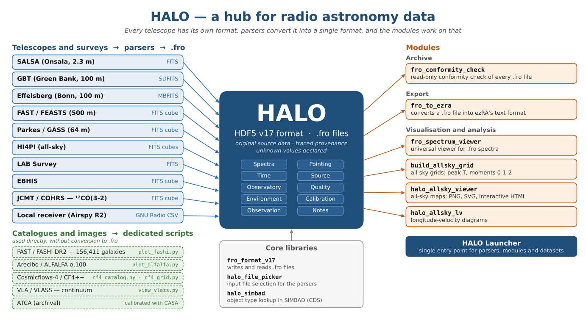

# HALO — Hub for Any Line Observation

*English · [Italiano](README_IT.md)*

**Bolzano/Bozen, Italy — 46.4946°N, 11.3353°E, 334 m a.s.l.**

---

### What is HALO?

HALO is an amateur radio astronomy project based in Bolzano, Italy, with an unusual ambition: to build a **telescope-agnostic, format-agnostic spectral data pipeline** that can ingest observations from any radio telescope — from a home-built receiver to the 500-metre FAST — and archive them in a single, unified HDF5 format for scientific analysis.

The project was born as FRO (Francesco Radio Observatory), a home-built receiver for the HI 21-cm line. It has since grown well beyond hydrogen: today HALO handles any spectral line at any frequency, and the name reflects it.

---

### From a home receiver to the Great Attractor

- **January 2026** — Project begins. A parabolic dish is 3D-printed in PETG: 1.2 m in diameter at f/D 0.6, plus an additional outer section that brings it to 1.8 m at f/D 0.4. Its feed, a cantenna, gave excellent results on the VNA. The dish was completed but never assembled with the feed: it did not fit on the balcony, and in the meantime the observations had moved to the Onsala radio telescopes. The receiver chain — Airspy R2 SDR and Nooelec SawBird H1 LNA — was tested with the ezRA suite using a 5-element Yagi antenna and a dummy load.
- **June–July 2026** — Remote observations of the Galactic plane with **SALSA** (Onsala Space Observatory, Sweden). An azimuth wrap-around bug in the SALSA slewing/integration system, found during these sessions, was reported and fixed by the Onsala team the same day (v1.1.8). The local receiver configuration (8192 channels @ 2.5 MSps, Airspy R2) was validated, reaching a velocity resolution of about **64 m/s per channel** at 1420 MHz with consumer-grade hardware.
- **Summer 2026** — The HDF5 v17 format is defined. Parsers written for **GBT** (Green Bank, 100 m), **FAST/FEASTS** (500 m, the largest single-dish radio telescope ever built), **HI4PI**, **LAB**, **EBHIS**, **Parkes/GASS** and **JCMT/COHRS** — ¹²CO(3-2) at 345.796 GHz, the first molecular line in the pipeline.
- **August 2026** — First contact with **Effelsberg** (MPIfR, Bonn): real MBFITS HI data of **Holmberg I** provided for parser development and validation.
- **September 2026** — All-sky HI maps and longitude-velocity diagrams from the full HI4PI dataset; the **FASHI DR2** catalogue (156,411 HI sources) and the **ALFALFA α.100** catalogue integrated.
- **September–October 2026** — **Cosmicflows-4** and the **CF4++** reconstructed velocity grids (Courtois et al. 2025): toward 3D maps of the basins of attraction (Laniakea, the Great Attractor). While analysing the public CF4++ grids, HALO found an x/y axis swap in the radial velocity grids (`vr_mean_CF4pp` and `vr_std_CF4pp`). The error was confirmed by Dr. Amber Hollinger, and a corrected file is being released by the CF4++ team. Explanation: [EN](docs/CF4pp_xy_swap_EN.pdf) · [IT](docs/CF4pp_xy_swap_IT.pdf); diagram: [EN](images/CF4pp_xy_swap_EN.svg) · [IT](images/CF4pp_xy_swap_IT.svg).

---

### Philosophy

- **No hardcoded assumptions.** Every parameter — frequency axis, bandwidth, number of channels, coordinates, epoch — is read dynamically from the source file. Nothing is assumed, everything is verified.
- **Unknown values declared.** If a quantity is not measured or not defined (e.g. the epoch of a mosaic product), it is explicitly flagged as unknown rather than filled with a plausible-looking value.
- **Original source data, traced provenance.** `.fro` files store the data exactly as provided by the observatory or survey team. HALO applies no smoothing, baseline subtraction or calibration of its own; any processing done upstream is recorded in the provenance metadata.
- **Nothing from the source is thrown away.** Quality flags, environmental data and calibration parameters are preserved on import.
- **No format lock-in.** The HDF5 format is the hub, not the destination. Export converters to ezRA, SDFITS and other formats are part of the roadmap.
- **Any line, any frequency.** From HI at 1.4 GHz to ¹²CO(3-2) at 345.796 GHz and beyond.

---

### Telescopes, surveys and catalogues

| Telescope / Survey | Frequency | Line / Data | Tool |
|---|---|---|---|
| Local (Airspy R2 + Yagi) | 1.4 GHz | HI | ezRA / ezColAirspy |
| SALSA (Onsala, 2.3 m) | 1.4 GHz | HI | `salsa_fits_to_fro.py` |
| GBT (Green Bank, 100 m) | 1.4 GHz | HI, H₂O | `gbt_sdfits_to_fro.py` |
| Effelsberg (Bonn, 100 m) | 1.4 GHz | HI | `mbfits_to_fro.py` |
| FAST/FEASTS (500 m) | 1.4 GHz | HI | `feasts_cube_to_fro.py` |
| FAST/FASHI DR2 | 1.4 GHz | HI source catalogue | `plot_fashi.py` |
| Arecibo/ALFALFA α.100 | 1.4 GHz | HI source catalogue | `plot_alfalfa.py` |
| Parkes/GASS (64 m) | 1.4 GHz | HI | `parkes_gass_to_fro.py` |
| HI4PI (all-sky) | 1.4 GHz | HI | `hi4pi_to_fro.py` |
| LAB Survey | 1.4 GHz | HI | `lab_to_fro.py` |
| EBHIS | 1.4 GHz | HI | `ebhis_to_fro.py` |
| ATCA (archival) | various | various | calibrated externally with CASA; final products imported |
| VLA/VLASS | 3 GHz | continuum | `view_vlass.py` (viewer) |
| JCMT/COHRS (15 m, Maunakea) | 345.796 GHz | ¹²CO(3-2) | `cohrs_to_fro.py` |
| Cosmicflows-4 / CF4++ | — | peculiar velocities, reconstructed velocity field | `cf4_catalog.py`, `cf4_grid.py` |

---

### The HDF5 v17 format (`.fro` files)

The format is defined by `fro_format_v17.py` and provides a common HDF5 structure for spectral observations from any telescope. Main groups:

- **Spectra** — spectra as provided by the source, frequency axis in Hz, optional cross-polarisation terms
- **Pointing** — Az/El, RA/Dec, GLon/GLat per integration
- **Time** — UTC timestamps, Unix time, integration duration
- **Source** — provenance metadata (facility, instrument, survey, dataset, provider)
- **Observatory** — physical location of the telescope that acquired the data
- **Quality** — tracking and calibration flags
- **Environment** — temperature, humidity, pressure per integration
- **Calibration** — per-feed polarisation and calibration parameters
- **Observation** — receiver, centre frequency, calibration notes
- **Notes** — free-text provenance and processing notes

The `UNKNOWN_EPOCH` sentinel is used for mosaic products where a per-pixel epoch is undefined (e.g. HI4PI, COHRS).

---

### Software and hardware

**Local receiver:**

- Airspy R2 SDR (2.5 / 10 MSps)
- Nooelec SawBird H1 LNA
- 5-element Yagi antenna
- 3D-printed parabolic dish, 1.2 m (f/D 0.6) or 1.8 m (f/D 0.4), with cantenna feed — built, not assembled
- Fujitsu ESPRIMO Q958 mini-PC, Ubuntu, Python 3.14

**HALO software:**

- **HALO Launcher** — single entry point to all parsers, modules and datasets
- Reusable modules: format library, spectrum viewer, all-sky grid builder, all-sky map viewer, longitude-velocity diagrams
- Viewers for each telescope (spectra, l-v diagrams, moment maps, peak temperature maps)

**External tools:**

- [ezRA suite](https://github.com/tedcline/ezRA) — analysis and visualisation, developed by Ted Cline (SARA); with contributions by Andrew Sutkowski (SARA) and Andrew Thornett (BAA/SARA)
- [DSPIRA](https://github.com/WVURAIL/gr-radio_astro) (Digital Signal Processing in Radio Astronomy) — GNU Radio framework by West Virginia University (WVURAIL); basis of the local SDR spectrometer

---

### Roadmap

- Parsers for the Italian radio telescopes: **SRT** (Sardinia Radio Telescope, 64 m, INAF), **Noto** (32 m, INAF) and **Medicina** (32 m, INAF)
- 3D visualisation of the cosmic basins of attraction from Cosmicflows-4 / CF4++
- Export to SDFITS
- Completion of the SALSA Galactic plane survey

---

### Collaborators and acknowledgements

- **Ted Cline** (SARA) — author of the ezRA suite; collaboration on parser development
- **Andrew Thornett** (BAA/SARA) — contributor to ezRA; organiser of the monthly S.A.R.A. videoconferences
- **Andrew Sutkowski** (SARA) — contributor to ezRA; analogue gauge designs and graphics for the HALO interface (work in progress)
- **Dr. Eskil Varenius** (Onsala Space Observatory) — SALSA support and observing methodology
- **Dr. Uwe Bach** (MPIfR, Effelsberg) — Effelsberg MBFITS HI data of Holmberg I
- **Dr. Jing Wang** (PKU/KIAA), FEASTS PI — FAST/FEASTS HI data of NGC 628
- **Dr. Chuan-Peng Zhang** (NAOC) — FAST coordinate script; FASHI first author
- **Prof. Hélène Courtois** (Université Claude Bernard Lyon 1) and **Dr. Amber Hollinger** (ANU) — CF4++ reconstructed grids; confirmation of the radial-grid axis swap
- **Prof. Mario Sandri** (Unione Astrofili Italiani; Associazione Italiana di Fisica) — astrophysicist and mentor of the project
- **Phoenix APS** (Cles, Trento) — amateur astronomy, astrophotography, radio astronomy and radio amateur club; HALO home community
- **Claude AI** (Anthropic) — development and documentation partner; parsers, format specification, viewers and documentation were written jointly

---

### Status

Work in progress. Parsers and modules are actively developed and validated; documentation is added progressively.

**Current focus:** Cosmicflows-4 / CF4++ basins of attraction, and the presentation of HALO at the I.C.A.R.A. 2026 congress (La Spezia, October 2026).

---

### Contact

Francesco Di Giovanni  
HALO Project — Bolzano/Bozen, Italy  
halo.observatory.bz [at] gmail [dot] com

If you notice any errors or have suggestions for additions, please feel free to open an issue or contact us directly.

*"Sky was just the beginning."*
