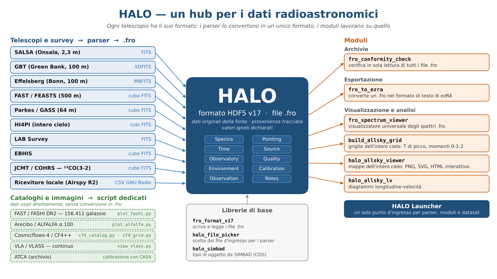

# HALO — Hub for Any Line Observation

*[English](README.md) · Italiano*

**Bolzano/Bozen, Italia — 46.4946°N, 11.3353°E, 334 m s.l.m.**

---

### Che cos'è HALO?

HALO è un progetto di radioastronomia amatoriale con sede a Bolzano, con un'ambizione insolita: costruire una **pipeline di dati spettrali indipendente dal telescopio e dal formato**, capace di importare osservazioni da qualsiasi radiotelescopio — da un ricevitore autocostruito fino ai 500 metri di FAST — e di archiviarle in un unico formato HDF5 per l'analisi scientifica.

Il progetto è nato come FRO (Francesco Radio Observatory), un ricevitore autocostruito per la riga HI a 21 cm. Da allora è cresciuto ben oltre l'idrogeno: oggi HALO tratta qualsiasi riga spettrale a qualsiasi frequenza, e il nome lo rispecchia.

---

### Da un ricevitore di casa al Grande Attrattore

- **Gennaio 2026** — Il progetto inizia. Viene stampata in 3D in PETG una parabola da 1,2 m di diametro con f/D 0,6, più una sezione esterna aggiuntiva che la porta a 1,8 m con f/D 0,4. L'illuminatore, una cantenna, ha dato ottimi risultati al VNA. La parabola è stata completata ma mai assemblata con l'illuminatore: non c'era spazio sul balcone e, nel frattempo, le osservazioni si erano spostate sui radiotelescopi di Onsala. La catena di ricezione — SDR Airspy R2 e LNA Nooelec SawBird H1 — è stata provata con la suite ezRA usando un'antenna Yagi a 5 elementi e un carico fittizio.
- **Giugno–luglio 2026** — Osservazioni remote del piano galattico con **SALSA** (Onsala Space Observatory, Svezia). Un bug di wrap-around dell'azimut nel sistema di puntamento/integrazione di SALSA, scoperto durante queste sessioni, è stato segnalato e corretto dal team di Onsala lo stesso giorno (v1.1.8). La configurazione del ricevitore locale (8192 canali a 2,5 MSps, Airspy R2) è stata validata, raggiungendo una risoluzione in velocità di circa **64 m/s per canale** a 1420 MHz con hardware di consumo.
- **Estate 2026** — Viene definito il formato HDF5 v17. Parser scritti per **GBT** (Green Bank, 100 m), **FAST/FEASTS** (500 m, il più grande radiotelescopio a parabola singola mai costruito), **HI4PI**, **LAB**, **EBHIS**, **Parkes/GASS** e **JCMT/COHRS** — ¹²CO(3-2) a 345,796 GHz, la prima riga molecolare nella pipeline.
- **Agosto 2026** — Primo contatto con **Effelsberg** (MPIfR, Bonn): dati MBFITS reali in HI di **Holmberg I** forniti per lo sviluppo e la validazione del parser.
- **Settembre 2026** — Mappe HI dell'intero cielo e diagrammi longitudine-velocità dall'intero dataset HI4PI; integrati il catalogo **FASHI DR2** (156.411 sorgenti HI) e il catalogo **ALFALFA α.100**.
- **Settembre–ottobre 2026** — **Cosmicflows-4** e le griglie di velocità ricostruite **CF4++** (Courtois et al. 2025): verso mappe 3D dei bacini di attrazione (Laniakea, il Grande Attrattore). Analizzando le griglie pubbliche CF4++, HALO ha individuato uno scambio degli assi x/y nelle griglie della velocità radiale (`vr_mean_CF4pp` e `vr_std_CF4pp`). L'errore è stato confermato dalla Dr.ssa Amber Hollinger, e il team CF4++ sta pubblicando un file corretto. Spiegazione: [IT](docs/CF4pp_xy_swap_IT.pdf) · [EN](docs/CF4pp_xy_swap_EN.pdf); diagramma: [IT](images/CF4pp_xy_swap_IT.svg) · [EN](images/CF4pp_xy_swap_EN.svg).

---

### Filosofia

- **Nessuna assunzione cablata nel codice.** Ogni parametro — asse delle frequenze, larghezza di banda, numero di canali, coordinate, epoca — viene letto dinamicamente dal file sorgente. Nulla è dato per scontato, tutto è verificato.
- **Valori ignoti dichiarati.** Se una grandezza non è misurata o non è definita (ad esempio l'epoca di un prodotto a mosaico), viene dichiarata esplicitamente come sconosciuta, invece di essere riempita con un valore plausibile.
- **Dati originali della fonte, provenienza tracciata.** I file `.fro` contengono i dati esattamente come forniti dall'osservatorio o dal team della survey. HALO non applica smoothing, sottrazione della linea di base né calibrazioni proprie; le elaborazioni fatte a monte sono registrate nei metadati di provenienza.
- **Non si butta nulla della sorgente.** Flag di qualità, dati ambientali e parametri di calibrazione vengono conservati all'importazione.
- **Nessun vincolo di formato.** Il formato HDF5 è il punto di raccolta, non la destinazione. I convertitori di esportazione verso ezRA, SDFITS e altri formati fanno parte della roadmap.
- **Qualsiasi riga, qualsiasi frequenza.** Dall'HI a 1,4 GHz al ¹²CO(3-2) a 345,796 GHz e oltre.

---

### Telescopi, survey e cataloghi

| Telescopio / Survey | Frequenza | Riga / Dati | Strumento |
|---|---|---|---|
| Locale (Airspy R2 + Yagi) | 1,4 GHz | HI | ezRA / ezColAirspy |
| SALSA (Onsala, 2,3 m) | 1,4 GHz | HI | `salsa_fits_to_fro.py` |
| GBT (Green Bank, 100 m) | 1,4 GHz | HI, H₂O | `gbt_sdfits_to_fro.py` |
| Effelsberg (Bonn, 100 m) | 1,4 GHz | HI | `mbfits_to_fro.py` |
| FAST/FEASTS (500 m) | 1,4 GHz | HI | `feasts_cube_to_fro.py` |
| FAST/FASHI DR2 | 1,4 GHz | catalogo di sorgenti HI | `plot_fashi.py` |
| Arecibo/ALFALFA α.100 | 1,4 GHz | catalogo di sorgenti HI | `plot_alfalfa.py` |
| Parkes/GASS (64 m) | 1,4 GHz | HI | `parkes_gass_to_fro.py` |
| HI4PI (intero cielo) | 1,4 GHz | HI | `hi4pi_to_fro.py` |
| LAB Survey | 1,4 GHz | HI | `lab_to_fro.py` |
| EBHIS | 1,4 GHz | HI | `ebhis_to_fro.py` |
| ATCA (archivio) | varie | varie | calibrazione esterna con CASA; importati i prodotti finali |
| VLA/VLASS | 3 GHz | continuo | `view_vlass.py` (visualizzatore) |
| JCMT/COHRS (15 m, Maunakea) | 345,796 GHz | ¹²CO(3-2) | `cohrs_to_fro.py` |
| Cosmicflows-4 / CF4++ | — | velocità peculiari, campo di velocità ricostruito | `cf4_catalog.py`, `cf4_grid.py` |

---

### Il formato HDF5 v17 (file `.fro`)

Il formato è definito da `fro_format_v17.py` e fornisce una struttura HDF5 comune per osservazioni spettrali di qualsiasi telescopio. Gruppi principali:

- **Spectra** — spettri come forniti dalla fonte, asse delle frequenze in Hz, termini di polarizzazione incrociata opzionali
- **Pointing** — Az/El, AR/Dec, GLon/GLat per ogni integrazione
- **Time** — tempi UTC, tempo Unix, durata dell'integrazione
- **Source** — metadati di provenienza (struttura, strumento, survey, dataset, fornitore)
- **Observatory** — posizione fisica del telescopio che ha acquisito i dati
- **Quality** — flag di inseguimento e di calibrazione
- **Environment** — temperatura, umidità, pressione per ogni integrazione
- **Calibration** — polarizzazione e parametri di calibrazione per ogni ingresso
- **Observation** — ricevitore, frequenza centrale, note di calibrazione
- **Notes** — note libere su provenienza ed elaborazione

Il valore sentinella `UNKNOWN_EPOCH` si usa per i prodotti a mosaico in cui l'epoca per pixel non è definita (ad esempio HI4PI, COHRS).

---

### Software e hardware

**Ricevitore locale:**

- SDR Airspy R2 (2,5 / 10 MSps)
- LNA Nooelec SawBird H1
- Antenna Yagi a 5 elementi
- Parabola stampata in 3D, 1,2 m (f/D 0,6) o 1,8 m (f/D 0,4), con illuminatore a cantenna — completata, non assemblata
- Mini-PC Fujitsu ESPRIMO Q958, Ubuntu, Python 3.14

**Software HALO:**

- **HALO Launcher** — punto d'ingresso unico per tutti i parser, i moduli e i dataset
- Moduli riutilizzabili: libreria del formato, visualizzatore di spettri, costruttore di griglie dell'intero cielo, visualizzatore di mappe dell'intero cielo, diagrammi longitudine-velocità
- Visualizzatori per ciascun telescopio (spettri, diagrammi l-v, mappe dei momenti, mappe della temperatura di picco)

**Strumenti esterni:**

- [Suite ezRA](https://github.com/tedcline/ezRA) — analisi e visualizzazione, sviluppata da Ted Cline (SARA)
- [DSPIRA](https://github.com/WVURAIL/gr-radio_astro) (Digital Signal Processing in Radio Astronomy) — framework GNU Radio della West Virginia University (WVURAIL); base dello spettrometro SDR locale

---

### Roadmap

- Parser per i radiotelescopi italiani: **SRT** (Sardinia Radio Telescope, 64 m, INAF), **Noto** (32 m, INAF) e **Medicina** (32 m, INAF)
- Visualizzazione 3D dei bacini di attrazione cosmici da Cosmicflows-4 / CF4++
- Esportazione in SDFITS
- Completamento della survey SALSA del piano galattico

---

### Collaboratori e ringraziamenti

- **Ted Cline** (SARA) — autore della suite ezRA; collaborazione allo sviluppo dei parser
- **Andrew Thornett** (BAA/SARA) — organizzatore delle videoconferenze mensili S.A.R.A.
- **Andrew Sutkowski** (SARA) — indicatori analogici e grafica per l'interfaccia HALO (in corso)
- **Dr. Eskil Varenius** (Onsala Space Observatory) — supporto SALSA e metodologia osservativa
- **Dr. Uwe Bach** (MPIfR, Effelsberg) — dati MBFITS HI di Holmberg I da Effelsberg
- **Dr. Jing Wang** (PKU/KIAA), PI di FEASTS — dati HI FAST/FEASTS di NGC 628
- **Dr. Chuan-Peng Zhang** (NAOC) — script delle coordinate FAST; primo autore di FASHI
- **Prof.ssa Hélène Courtois** (Université Claude Bernard Lyon 1) e **Dr.ssa Amber Hollinger** (ANU) — griglie ricostruite CF4++; conferma dello scambio degli assi nelle griglie radiali
- **Prof. Mario Sandri** (Unione Astrofili Italiani; Associazione Italiana di Fisica) — astrofisico e mentore del progetto
- **Phoenix APS** (Cles, Trento) — circolo di astronomia amatoriale, astrofotografia, radioastronomia e radioamatori; comunità di riferimento di HALO
- **Claude AI** (Anthropic) — partner di sviluppo e documentazione; parser, specifica del formato, visualizzatori e documentazione sono stati scritti insieme

---

### Stato

Lavoro in corso. Parser e moduli sono in sviluppo e validazione attivi; la documentazione viene aggiunta progressivamente.

**Focus attuale:** bacini di attrazione da Cosmicflows-4 / CF4++, e la presentazione di HALO al congresso I.C.A.R.A. 2026 (La Spezia, ottobre 2026).

---

### Contatti

Francesco Di Giovanni  
HALO Project — Bolzano/Bozen, Italia  
halo.observatory.bz [at] gmail [dot] com

Se notate errori o avete suggerimenti, aprite pure una issue o scriveteci direttamente.

*"Sky was just the beginning."*
